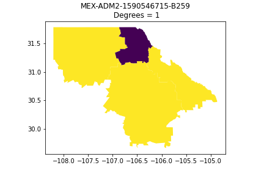
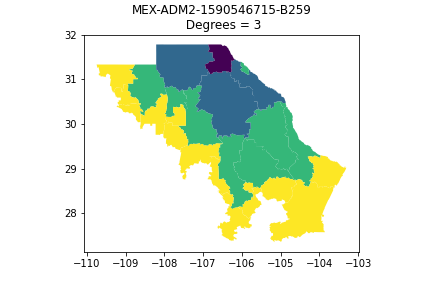
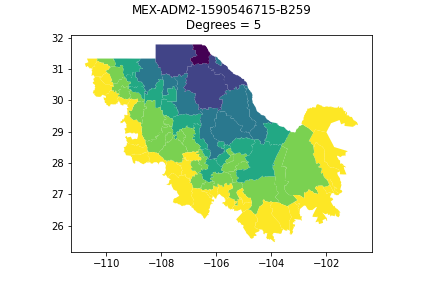
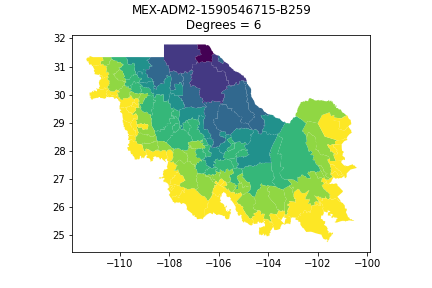

## GeoGraph
This repo contaisn the code to read in spatial data in graph format. Functions provide ability to specify number of neighbors to include (i.e. number of degrees away to count neighbors). Classes provide feature matrix, global graph feature (i.e. y variable), adjacency matrix, neighbor dictionary and edge lists.

### Files:
1. GeoGraph: Loads a graph based ona shapefile (i.e. vector data)
2. GeoPath: Loads a graph assuming two target nodes and directionality

### Sample GeoGraph's

### Sample GeoPath's

